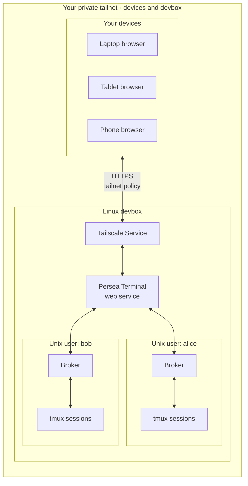

#  Persea Terminal

**Your tmux sessions, in a browser on your tailnet.**

Run Persea Terminal on your Linux devbox and reach your shells, editors, builds,
and coding agents from a laptop, tablet, or phone. Your work stays on the devbox
when you close the browser or lose your connection.

- **Keep sessions together.** Open multiple terminals in one workspace.
- **Pick up where you left off.** Reconnect restores retained output; uncertain input is never replayed.
- **Use your existing workflow.** Native tmux clients can stay attached. Opening a browser does not resize your session.
- **Work from a phone.** Touch controls, a text composer, and a terminal key row keep common actions close.

## How it works



Connect your devices to Tailscale and open the terminal's Service URL.
[Tailnet access rules](https://tailscale.com/kb/1552/tailscale-services) determine
which devices can reach it; Persea Terminal also checks the configured Tailscale
login. The deployment runs a dedicated Tailscale identity on the devbox and
forwards requests to Persea Terminal over a local Unix socket.

**Access is private and single-operator:** one configured person can access all
configured Linux user accounts (called *realms*). Only explicitly configured tmux
servers are available. See the [security model](SECURITY.md).

## Get started

### Requirements

- **Server:** Linux and tmux. Production installation also uses systemd, Tailscale,
  and administrator access.
- **Build from source:** Go, Node.js, and npm at the versions specified in
  [go.mod](go.mod), [ui/.nvmrc](ui/.nvmrc), and [ui/package.json](ui/package.json);
  Bash, Python 3, and standard GNU utilities.
- **Client:** a modern browser; Tailscale access for remote use. Node.js and npm
  are not needed to run the installed service.

### Quick Start

On your devbox, follow the [deployment guide](deploy/README.md), or ask a coding
agent to work through it with you:

1. **Choose what to expose.** Configure the Unix users, their tmux servers, and
   your Tailscale login in `/etc/persea-terminal/host.json`, using
   [host.example.json](deploy/host.example.json) as a starting point.
2. **Build and install.** Prepare the required toolchain, then run the installer.
   It installs the web service and a broker running as each configured Unix user.
3. **Set up private access.** Enroll the service's dedicated Tailscale identity;
   approve its Service and restrict access to the intended users and devices
   through your tailnet policy. Persea Terminal also checks your configured login.
4. **Open your terminals.** Visit the Service's HTTPS URL from an allowed device.
   In the dashboard, choose a configured Unix user and open an existing tmux
   session or create a new one.

Keep your host manifest and credentials outside the repository.

### Try it locally

Clone or download this repository to your Linux devbox, then run from the
repository directory:

```sh
scripts/local-start.sh
```

The launcher installs dependencies, builds the application, and prints a local
`URL=` to open. It creates an isolated tmux session for the demo. Use the printed
`STOP_COMMAND=` when finished; `TMUX_ATTACH=` lets you return to that session.
This demo is local to the devbox; follow Quick Start above for other devices.

## Help and contributing

Bug reports and contributions are welcome. Include steps to reproduce and your
browser and operating system; remove terminal content and private network details
before sharing logs.

- [Contributing and tests](CONTRIBUTING.md) · [Agent instructions](AGENTS.md)
- [Dependency updates and the xterm patch](ui/DEPENDENCIES.md)
- [Changelog](CHANGELOG.md) · [Releases](RELEASING.md)
- [Security and vulnerability reporting](SECURITY.md)

## License

[MIT](LICENSE).
